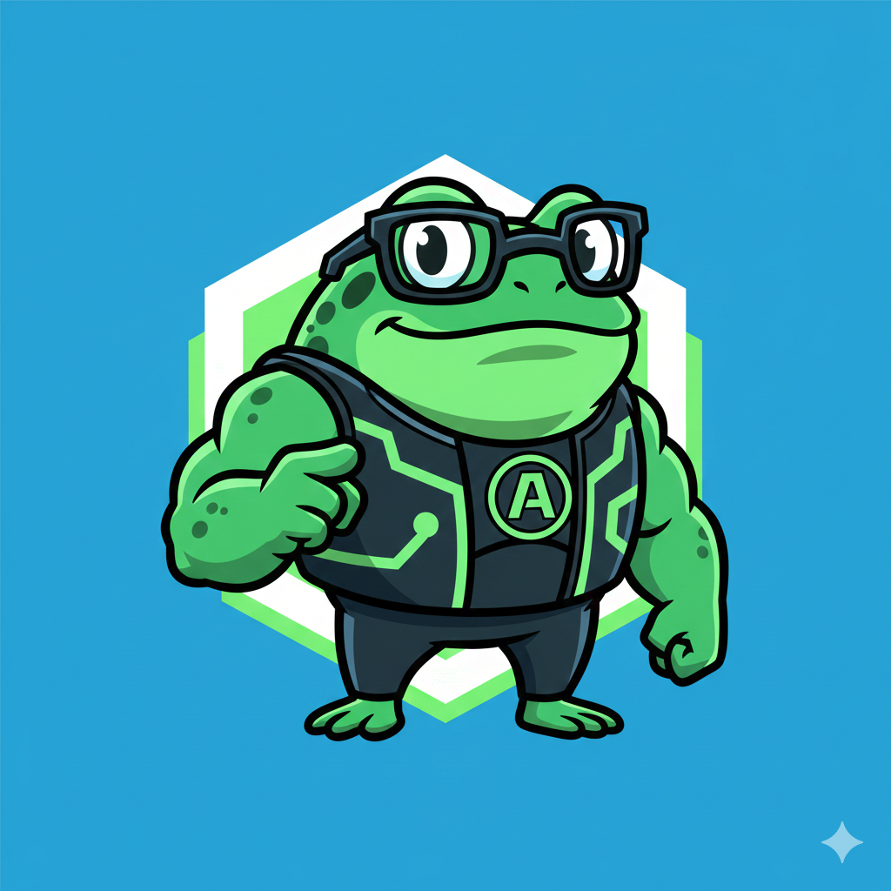

<div align="center">
  

# 🐸 KakoClaw: The Apex AI Agent

### **Ultrafast · 10MB RAM · $10 Hardware · Self-Bootstrapped**

[](https://go.dev/)
[](LICENSE)
[](https://github.com/sipeed/KakoClaw)

**"皮皮虾，我们走！" — _Let's go, Mantis Shrimp!_**

</div>

---

## 🌟 Why KakoClaw?

**KakoClaw** is not just another AI assistant. It is a masterpiece of efficiency, born from the code of [PicoClaw](https://github.com/sipeed/picoclaw) and the inspiration of [Nanobot](https://github.com/HKUDS/nanobot).

While other "Claw" projects require heavy resources and expensive hardware, KakoClaw reigns supreme in the realm of **efficiency**:

- 🚀 **1s Boot**: It's ready before you can blink.
- 🧠 **10MB RAM**: Runs comfortably on a toaster.
- 💸 **$10 Hardware**: Optimized for low-cost RISC-V and ARM boards.
- 🤖 **Agent-Refined**: 95% of its core was built by AI, for AI.

---

## 🏆 The "Claw" Comparison

| Feature              |    OpenClaw     |  NanoBot  |    **KakoClaw**     |
| :------------------- | :-------------: | :-------: | :-----------------: |
| **Language**         |   TypeScript    |  Python   |   **Go (Native)**   |
| **RAM Usage**        |      > 1GB      |  > 100MB  |     **< 10MB**      |
| **Startup (0.8GHz)** |     > 500s      |   > 30s   |      **< 1s**       |
| **Hardware Cost**    | Mac Mini ($599) | SBC ($50) | **Any Board ($10)** |
| **Philosophy**       |     Bloated     | Flexible  | **Apex Efficiency** |

---

## 🤝 Respecting the Roots

KakoClaw is a proud evolution and a hard-fork of [PicoClaw](https://github.com/sipeed/picoclaw). We stand on the shoulders of giants:

1.  **[PicoClaw](https://github.com/sipeed/picoclaw)**: Our direct ancestor and the foundation of our vision.
2.  **[Nanobot](https://github.com/HKUDS/nanobot)**: The original spark of inspiration for ultra-lightweight assistants.

We believe in the democratization of AI. By taking the work of PicoClaw and optimizing it to the extreme in Go, we've created the most efficient agent in the ecosystem.

---

## ✨ Features that WOW

- 🪶 **Stateless & Portable**: Single binary, zero dependencies.
- 📡 **Multi-Channel**: Telegram, Discord, QQ, DingTalk, and more.
- 🛠️ **Powerful Tools**: File management, Web Search (Brave), Shell execution, Subagents.
- 📅 **Smart Cron**: Automated tasks and reminders.
- 🎙️ **Voice Ready**: Free transcription via Groq/Whisper.
- 💻 **Experimental Web UI**: A modern Kanban-style dashboard for task management.

---

## 🚀 Quick Start

### 1. Installation

```bash
git clone https://github.com/sipeed/KakoClaw.git
cd KakoClaw
make build
make install
```

### 2. Onboarding

```bash
KakoClaw onboard
```

### 3. Start Chatting

```bash
# Direct message
KakoClaw agent -m "Calculate the potential of a $10 RISC-V board"

# Interactive mode
KakoClaw agent
```

---

## 📚 Documentation

Dive deeper into our [Comprehensive Documentation](./docs/README.md):

- 🏗️ [Architecture](./docs/architecture/overview.md)
- 🚀 [Deployment Guides](./docs/deployment/docker.md)
- 💻 [Developer Setup](./docs/development/setup.md)
- 🔧 [Troubleshooting](./docs/troubleshooting/common-issues.md)

---

## 🛡️ Community & Support

- **Discord**: [Join the Sipeed Community](https://discord.gg/V4sAZ9XWpN)
- **Issues**: [Report a Bug](https://github.com/sipeed/KakoClaw/issues)

---

<div align="center">
  
  <p><i>Join our WeChat community for real-time updates!</i></p>
</div>

---

**KakoClaw** is licensed under the [MIT License](LICENSE).  
_Apex Efficiency. Infinite Possibilities._
