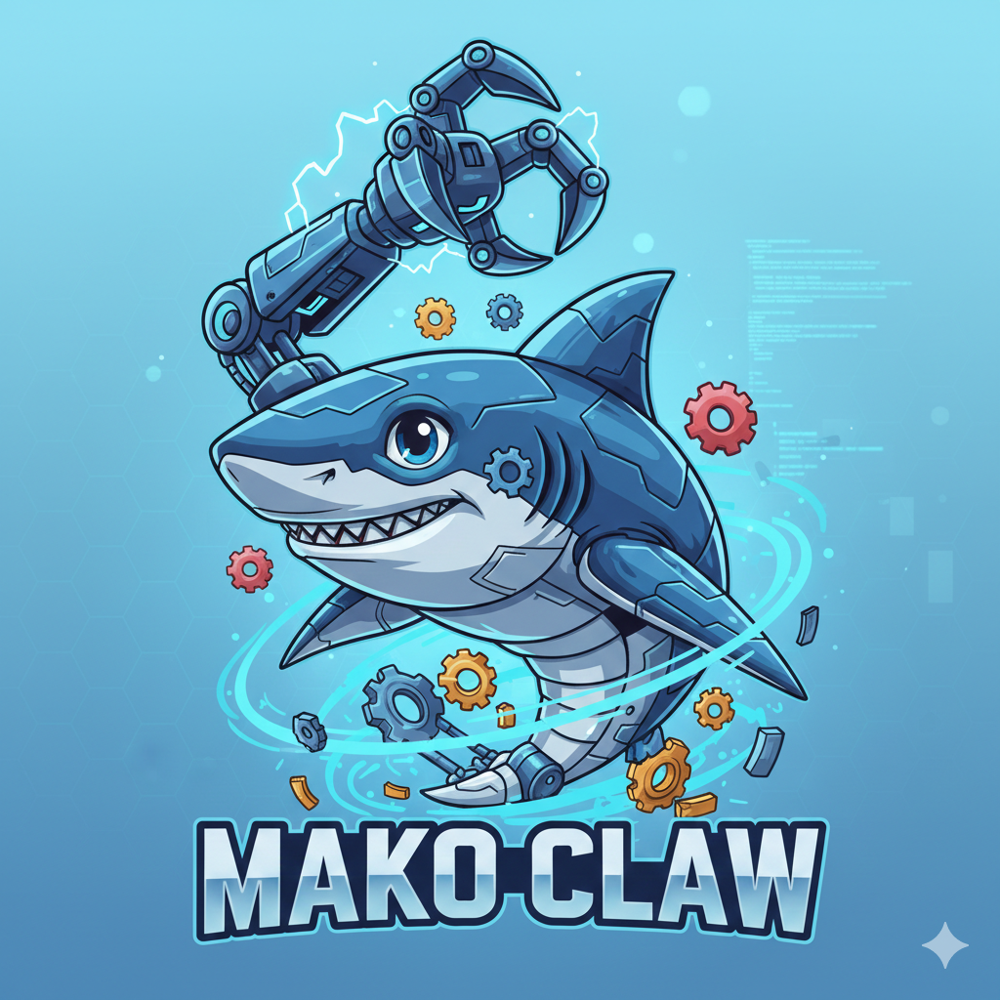

# Documentación de MakoClaw

Bienvenido a la documentación oficial de **MakoClaw** — La plataforma de agentes de IA de alto nivel.

<div align="center">
  
  
  **🦈 MakoClaw — The Apex AI Agent**
  
  <em>Ultrafast · 10MB RAM · &lt;$10 Hardware · Self-Bootstrapped</em>
</div>

---

## 🗺️ [Hoja de Ruta](./ROADMAP.md)

Plan de desarrollo y próximas funcionalidades.

## 📚 Estructura de la Documentación

### 🏗️ [Arquitectura](./architecture/)

Documentación técnica sobre la estructura interna y diseño del sistema.

- [Visión General](./architecture/overview.md)
- [Flujo de Datos](./architecture/data-flow.md)
- [Componentes Principales](./architecture/components.md)
- [Diagramas del Sistema](./architecture/diagrams.md)

### 📖 [Guías de Usuario](./guides/)

Guías paso a paso para usuarios finales.

- **[Guía de Inicio Rápido](./guides/quickstart.md)** — Comienza en menos de 5 minutos
- [Resumen de Inicio Rápido](./guides/QUICK_START_OVERVIEW.md)
- **[Modo Degradado](./guides/degraded-mode.md)** — Iniciar sin configuración LLM
- [Instalación y Configuración](./guides/installation.md)
- [Configuración de Proveedores LLM](./guides/llm-providers.md)
- [Canales de Mensajería](./guides/channels.md)
- [Uso del Agente CLI](./guides/agent-cli.md)
- [Tareas Programadas (Cron)](./guides/cron-jobs.md)
- [Sistema de Skills](./guides/skills.md)
- [Configuración de Email](./guides/email-setup.md)

### 💻 [Desarrollo](./development/)

Documentación para contribuidores y desarrolladores.

- [Configuración del Entorno](./development/setup.md)
- [Estructura del Proyecto](./development/project-structure.md)
- [Guía de Contribución](./development/contributing.md)
- [Configuración de Agentes y Tips](./development/AGENTS.md)
- [Multi-Agent System](./development/MULTI_AGENT_SETUP.md)
- [Inicio Rápido del Frontend](./development/FRONTEND_QUICK_START.md)
- [Crear un Nuevo Tool](./development/creating-tools.md)
- [Crear un Nuevo Canal](./development/creating-channels.md)
- [Crear un Nuevo Skill](./development/creating-skills.md)
- [Tests y Calidad](./development/testing.md)
- [Convenciones de Código](./development/code-conventions.md)

### 📋 [Referencia de API](./api-reference/)

Documentación de referencia de interfaces y APIs.

- [Tools API](./api-reference/tools.md)
- **[Workflows API](./api-reference/workflows.md)** — REST API para automatización
- [Providers API](./api-reference/providers.md)
- [Channels API](./api-reference/channels.md)
- [Config API](./api-reference/config.md)
- [Agent API](./api-reference/agent.md)

### 🚀 [Despliegue](./deployment/)

Guías para desplegar MakoClaw en diferentes entornos.

- [Despliegue Local](./deployment/local.md)
- [Despliegue en Servidor](./deployment/server.md)
- **[Docker](./deployment/docker.md)** — Contenedores listos para producción
- [Despliegue Docker Detallado](./deployment/DOCKER_DEPLOYMENT.md)
- [Systemd Service](./deployment/systemd.md)
- [Placas ARM/RISC-V](./deployment/embedded.md)
- [MakoClaw en Android (Termux)](./deployment/termux-android.md)

### 🎯 [Ejemplos](./examples/)

Ejemplos prácticos y casos de uso.

- [Ejemplos Básicos](./examples/basic-examples.md)
- **[Workflows Completos](./examples/workflows.md)** — Guía completa de automatización multi-paso
- **[Templates de Workflows](./examples/workflow-templates.json)** — Workflows listos para importar
- [Automatización de Tareas](./examples/automation.md)
- [Integraciones](./examples/integrations.md)

### 🔧 [Solución de Problemas](./troubleshooting/)

Ayuda para resolver problemas comunes.

- **[Workflows Troubleshooting](./troubleshooting/workflows.md)** — Problemas específicos de workflows
- [Problemas Comunes](./troubleshooting/common-issues.md)
- [Errores de Configuración](./troubleshooting/config-errors.md)
- [Problemas de Canales](./troubleshooting/channel-issues.md)
- [Debugging](./troubleshooting/debugging.md)
- [FAQ](./troubleshooting/faq.md)

### 📊 [Análisis de Issues](./issues-analysis/)

Análisis y clasificación de issues abiertas en GitHub.

- [Resumen Ejecutivo](./issues-analysis/summary.md) — Overview de todas las issues
- [Análisis Completo](./issues-analysis/README.md) — Clasificación detallada
- [Planes de Implementación](./issues-analysis/implementation-plans.md) — Guías para contribuir

### 📈 [Reportes y Bitácoras](./)

Documentación detallada sobre el estado y cambios del proyecto.

- [Reporte Completo: MakoClaw](./REPORTE_COMPLETO_PICACLAW.md)
- [Changelog del Panel Web](./WEB_PANEL_CHANGELOG.md)
- [Changelog General y Revisión](./APP_REVIEW_AND_CHANGELOG.md)

### 📜 [Archivo de Sesiones](./archive/)

Historial de implementaciones y resúmenes de sesiones pasadas.

- [Resumen de Implementación de UI/UX](./archive/IMPLEMENTATION_SUMMARY.md)
- [Resumen de Feature de Cancelación](./archive/IMPLEMENTATION_SUMMARY_CANCEL_FEATURE.md)
- [Referencia Rápida de Feature de Cancelación](./archive/QUICK_REFERENCE_CANCEL_FEATURE.md)
- [Resumen de Sesión](./archive/SESSION_SUMMARY.md)

---

## 🚀 Empezando

### Instalación Rápida

```bash
# Clonar el repositorio
git clone https://github.com/sipeed/MakoClaw.git
cd MakoClaw

# Compilar
make build

# Instalar
make install

# Inicializar configuración
MakoClaw onboard
```

### Primer Uso

```bash
# Configurar tu API key en ~/.MakoClaw/config.json

# Iniciar una conversación
MakoClaw agent -m "Hola, ¿qué puedes hacer?"

# O modo interactivo
MakoClaw agent
```

### Panel Web

```bash
# Iniciar servidor web
MakoClaw web

# Abrir http://localhost:18880
```

---

## 🦈 Características Principales

### 🤖 Multi-Agent System

- **Orchestrator**: Delega automáticamente tareas a especialistas
- **Specialists**: Agentes especializados para tareas específicas
- **Auto-delegation**: El sistema decide qué specialist usar

### 📡 9+ Canales de Integración

- **Web UI**: Panel web completo con chat, workflows, tareas
- **Telegram**: Bot de mensajería instantánea
- **Discord**: Integración completa con servidores
- **Slack**: Canales de trabajo
- **WhatsApp**: Comunicación empresarial
- **Signal**: Mensajería segura
- **QQ**: Comunicación en China
- **DingTalk**: Colaboración empresarial
- **Feishu**: Plataforma de productividad
- **MaixCam**: Hardware AI camera

### 🛠️ Herramientas Poderosas

#### Gestión de Archivos

- `read_file`: Leer archivos
- `write_file`: Crear y editar archivos
- `list_dir`: Listar directorios
- `edit_file`: Edición asistida por LLM

#### Búsqueda Web

- `web_search`: Buscar en Brave Search
- `web_fetch`: Obtener contenido de URLs

#### Ejecución

- `exec`: Ejecutar comandos shell
- `spawn`: Crear subagentes

#### Gestión de Tareas

- `task_manager`: Crear, listar, actualizar tareas (Kanban)

#### Conocimiento

- `query_knowledge`: Búsqueda en base de documentos (RAG)

#### Otros

- `message`: Envío de mensajes
- `schedule`: Programar tareas
- `email`: Envío de emails
- `memory`: Gestión de memoria

### 📊 Productividad

#### Kanban Task Board

- Backlog, To Do, In Progress, Review, Done
- La IA puede crear y actualizar tareas
- Filtrado, búsqueda, y archivado

#### Visual Workflows

- Builder visual drag-and-drop
- Prompts, tools, y condiciones
- Ejecución en tiempo real
- Historial de ejecuciones

#### Cron Jobs

- Tareas programadas
- Expresiones cron estándar
- Ejecución manual

### 🧠 Conocimiento

#### Knowledge Base (RAG)

- Upload de documentos (PDF, TXT, MD, JSON, CSV, HTML, XML, YAML, LOG)
- Búsqueda semántica
- Recuperación contextual

### 🔒 Seguridad y Privacidad

- Self-hosted: Tus datos en tu infraestructura
- Multi-user authentication
- OAuth 2.0 con PKCE
- Session management
- Workspace isolation

### ⚡ Eficiencia Técnica

- **Go (Native)**: Código nativo compilado
- **&lt;10MB RAM**: Ultra ligero
- **&lt;1s Boot**: Arranca instantáneamente
- **Docker Ready**: Contenedores pre-configurados
- **REST API**: Integración programática

---

## 📊 Estadísticas del Proyecto

- **Lenguaje**: Go 1.21+
- **Líneas de código**: ~13,600
- **Archivos**: 56 archivos Go
- **Memoria**: &lt;10MB RAM
- **Tiempo de arranque**: &lt;1 segundo
- **Licencia**: MIT

---

## 🤝 Contribuir

¡Las contribuciones son bienvenidas! Por favor lee nuestra [Guía de Contribución](./development/contributing.md) antes de enviar un PR.

---

## 💬 Comunidad

- GitHub Issues: [https://github.com/sipeed/MakoClaw/issues](https://github.com/sipeed/MakoClaw/issues)
- Discord: [https://discord.gg/V4sAZ9XWpN](https://discord.gg/V4sAZ9XWpN)
- WeChat: Ver QR en [README principal](../README.md)

---

## 📄 Licencia

MakoClaw está licenciado bajo la Licencia MIT. Ver [LICENSE](../LICENSE) para más detalles.

---

<div align="center">

**Versión de la documentación**: 2.0  
**Última actualización**: Febrero 2026  
**MakoClaw — The Apex AI Agent**

</div>
