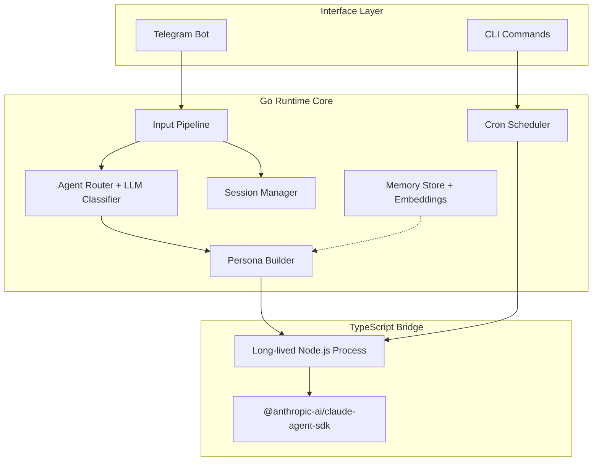

# 🔍 Aurelia OS — Análisis Técnico Exhaustivo

> **Objetivo**: Evaluar qué funcionalidades, patrones y arquitectura de Aurelia OS pueden ser útiles para Kakoclaw, especialmente para programación local con herramientas de IA (opencode, Claude Code, etc.)

---

## 1. ¿Qué ES Aurelia OS?

Aurelia es un **"agent operating system" local-first** escrito en Go (~6,800 líneas Go + ~270 líneas TypeScript). Su propósito es orquestar agentes de IA autónomos que ejecutan tareas en tu máquina local, accesibles vía Telegram.

> [!IMPORTANT]
> Aurelia NO reimplementa lo que Claude Code ya hace. Aurelia **orquesta** Claude Code — agregando persistencia, scheduling, multi-proyecto, y una interfaz natural (Telegram) encima.

### Stack técnico

| Componente | Tecnología |
|-----------|-----------|
| Runtime principal | Go 1.25+ |
| "Cerebro" (LLM) | TypeScript Bridge → `@anthropic-ai/claude-agent-sdk` |
| Almacenamiento | SQLite (modernc.org/sqlite, pure Go) |
| Interface usuario | Telegram Bot API (telebot.v3) |
| Embeddings locales | Hugot (ONNX, pure Go) |
| STT (voz → texto) | Groq Whisper API |
| Scheduling | robfig/cron/v3 + SQLite persistence |
| Markdown parsing | goldmark |
| Config | JSON (`~/.aurelia/config/app.json`) |

---

## 2. Arquitectura General



### Flujo de un mensaje

```
1. Usuario → Telegram (texto/foto/voz/documento)
2. Pipeline extrae contenido (STT si es voz, download si es foto)
3. Agent Router clasifica → agente especialista o general
4. System prompt ensamblado: persona + agente + instrucciones cron + instrucciones telegram
5. Request enviado al Bridge (proceso TypeScript long-lived)
6. Bridge llama Claude SDK → Claude Code CLI ejecuta
7. Eventos streameados: tool_use → progreso, assistant → texto, result → respuesta
8. Respuesta entregada a Telegram (reply-to al mensaje original)
9. Token usage trackeado, auto-reset si se supera el threshold
```

---

## 3. Desglose de Módulos

### 3.1 Bridge (Go ↔ TypeScript) ⭐⭐⭐

**🔑 EL componente más valioso para nosotros.**

| Archivo | Propósito |
|---------|-----------|
| [bridge.go](file:///c:/Users/tfurt/source/repos/kakoclaw/study/aurelia/internal/bridge/bridge.go) | Go client: proceso long-lived, multiplexado |
| [protocol.go](file:///c:/Users/tfurt/source/repos/kakoclaw/study/aurelia/internal/bridge/protocol.go) | Request/Response types |
| [events.go](file:///c:/Users/tfurt/source/repos/kakoclaw/study/aurelia/internal/bridge/events.go) | Event types (system, tool_use, assistant, result, error, pong) |
| [setup.go](file:///c:/Users/tfurt/source/repos/kakoclaw/study/aurelia/internal/bridge/setup.go) | Auto-bootstrapping del bridge con npm install |
| [embed.go](file:///c:/Users/tfurt/source/repos/kakoclaw/study/aurelia/internal/bridge/embed.go) | `go:embed` del bundle.ts en el binario Go |
| [index.ts](file:///c:/Users/tfurt/source/repos/kakoclaw/study/aurelia/bridge/index.ts) | Bridge TypeScript — wrapper del Claude Agent SDK |

**Protocolo NDJSON multiplexado:**

```
Go → Bridge (stdin):
{"command":"query","request_id":"req-1","prompt":"...","options":{...}}

Bridge → Go (stdout):
{"event":"system","request_id":"req-1","session_id":"abc-123","tools":[...]}
{"event":"tool_use","request_id":"req-1","name":"Read","input":{...}}
{"event":"assistant","request_id":"req-1","text":"..."}
{"event":"result","request_id":"req-1","content":"...","cost_usd":0.12}
```

**Features clave del Bridge:**
- **Proceso long-lived** — no se crea/destruye por request, sino que se reutiliza
- **Multiplexing** — múltiples requests concurrentes con `request_id` correlation
- **Auto-recovery** — `onDeath` callback cuando el proceso muere
- **Session resume** — puede retomar sesiones cold (de disco) o warm (activas)
- **Multi-provider** — Anthropic, Kimi, OpenRouter, Z.ai, Alibaba (todos vía Anthropic-compatible endpoints)
- **Cloud MCP servers** — carga MCPs de claude.ai via OAuth
- **`go:embed`** — el bundle.ts se embebe en el binario Go para distribución zero-dependency
- **Ping/healthcheck** — `Ping()` verifica que el proceso responde

---

### 3.2 Agent Registry

| Archivo | Propósito |
|---------|-----------|
| [registry.go](file:///c:/Users/tfurt/source/repos/kakoclaw/study/aurelia/internal/agents/registry.go) | Carga, routing, clasificación LLM |
| [types.go](file:///c:/Users/tfurt/source/repos/kakoclaw/study/aurelia/internal/agents/types.go) | Agent struct |
| [sdk.go](file:///c:/Users/tfurt/source/repos/kakoclaw/study/aurelia/internal/agents/sdk.go) | Conversion a formato Claude SDK |

**Formato de agente (Markdown + YAML frontmatter):**

```markdown
---
name: prospector
description: Busca leads y contactos
model: kimi-k2-thinking
schedule: "0 9 * * 1"
cwd: D:\projects\crm
mcp_servers:
  google-places: { command: "npx google-places-mcp" }
allowed_tools: ["WebSearch", "WebFetch", "Bash"]
---

Sos un agente de prospección comercial.
Buscá empresas en Google Places...
```

**Routing inteligente en 2 pasos:**
1. **@agentname** — routing directo por mención
2. **LLM Classification** — si no hay @, usa el LLM para clasificar a qué agente va

---

### 3.3 Session Management

| Archivo | Propósito |
|---------|-----------|
| [store.go](file:///c:/Users/tfurt/source/repos/kakoclaw/study/aurelia/internal/session/store.go) | Session IDs por chat + cwds |
| [tracker.go](file:///c:/Users/tfurt/source/repos/kakoclaw/study/aurelia/internal/session/tracker.go) | Token usage tracking + auto-reset |

**Capabilities:**
- **Warm sessions** (process alive) → `Continue: true` → conversación continua
- **Cold sessions** (process restarted) → `Resume: session_id` → retoma desde disco
- **Auto-reset** — cuando los tokens acumulados superan `max_session_tokens` (default 100K), se resetea automáticamente
- **DeactivateAll** — cuando el bridge muere, todas las sessions pasan a "cold" (resume en vez de continue)
- **Token estimation** — `estimatedTokensPerTurn = 3000`

---

### 3.4 Cron Scheduler ⭐⭐

| Archivo | Propósito |
|---------|-----------|
| [types.go](file:///c:/Users/tfurt/source/repos/kakoclaw/study/aurelia/internal/cron/types.go) | CronJob, CronExecution, interfaces |
| [scheduler.go](file:///c:/Users/tfurt/source/repos/kakoclaw/study/aurelia/internal/cron/scheduler.go) | Polling loop, job execution |
| [runtime.go](file:///c:/Users/tfurt/source/repos/kakoclaw/study/aurelia/internal/cron/runtime.go) | BridgeCronRuntime — ejecuta via Claude SDK |
| [service.go](file:///c:/Users/tfurt/source/repos/kakoclaw/study/aurelia/internal/cron/service.go) | CRUD de jobs |
| [delivery.go](file:///c:/Users/tfurt/source/repos/kakoclaw/study/aurelia/internal/cron/delivery.go) | TelegramDelivery — envía resultados |
| store_*.go | SQLite persistence |

**Scheduling persistente:**
- **Cron expressions** — `"0 9 * * 1"` = lunes 9:00
- **One-shot** — `RunAt: timestamp` para ejecución única
- **Polling** — cada 15 segundos verifica jobs due
- **NotifyingRuntime** — decorator pattern: ejecuta + entrega resultado
- **Guard de concurrencia** — `sync.Map` previene ejecución duplicada
- **Transaccional** — execution recording + job update en una sola transacción SQLite

---

### 3.5 Memory Store (Embeddings) ⭐⭐

| Archivo | Propósito |
|---------|-----------|
| [store.go](file:///c:/Users/tfurt/source/repos/kakoclaw/study/aurelia/internal/memory/store.go) | SQLite + cosine similarity search |
| [embeddings.go](file:///c:/Users/tfurt/source/repos/kakoclaw/study/aurelia/internal/memory/embeddings.go) | Embedder interface + MockEmbedder |
| [embeddings_hugot.go](file:///c:/Users/tfurt/source/repos/kakoclaw/study/aurelia/internal/memory/embeddings_hugot.go) | HugotEmbedder (ONNX, local, pure Go) |

**Sistema de memoria semántica LOCAL:**
- **Embeddings locales** via Hugot (all-MiniLM-L6-v2, 384 dims, ONNX)
- **Zero API calls** — todo corre en local, sin costo
- **Cosine similarity** — búsqueda semántica en Go puro
- **Categorización** — fact, conversation, decision, preference
- **Injection automática** — `Inject()` busca memorias relevantes y las mete en el system prompt como markdown
- **Ser/Deserialización** — embeddings almacenados como BLOBs binarios en SQLite

---

### 3.6 Persona System

| Archivo | Propósito |
|---------|-----------|
| [loader.go](file:///c:/Users/tfurt/source/repos/kakoclaw/study/aurelia/internal/persona/loader.go) | Carga IDENTITY.md + SOUL.md + USER.md |
| [canonical_service.go](file:///c:/Users/tfurt/source/repos/kakoclaw/study/aurelia/internal/persona/canonical_service.go) | Assembler del system prompt |
| [loader_files.go](file:///c:/Users/tfurt/source/repos/kakoclaw/study/aurelia/internal/persona/loader_files.go) | Lectura de archivos opcionales |
| [canonical_service_prompt.go](file:///c:/Users/tfurt/source/repos/kakoclaw/study/aurelia/internal/persona/canonical_service_prompt.go) | Owner playbook + project docs injection |

**3 capas de identidad:**
1. **IDENTITY.md** — nombre, rol, reglas, personalidad
2. **SOUL.md** — tono, estilo, comportamiento
3. **USER.md** — información del usuario, preferencias

**Extras opcionales:**
- **OWNER_PLAYBOOK.md** — instrucciones del "dueño" del bot
- **LESSONS_LEARNED.md** — conocimiento acumulado
- **PROJECT_PLAYBOOK.md** — reglas por proyecto

---

### 3.7 Telegram Pipeline

| Archivo | Propósito | Líneas |
|---------|-----------|--------|
| [input_pipeline.go](file:///c:/Users/tfurt/source/repos/kakoclaw/study/aurelia/internal/telegram/input_pipeline.go) | Pipeline async completo | 500 |
| [input.go](file:///c:/Users/tfurt/source/repos/kakoclaw/study/aurelia/internal/telegram/input.go) | Handlers texto/foto/voz/documento | 280 |
| [bot.go](file:///c:/Users/tfurt/source/repos/kakoclaw/study/aurelia/internal/telegram/bot.go) | Controller, wiring | 139 |
| [output.go](file:///c:/Users/tfurt/source/repos/kakoclaw/study/aurelia/internal/telegram/output.go) | Envío con chunking | ~100 |
| [progress.go](file:///c:/Users/tfurt/source/repos/kakoclaw/study/aurelia/internal/telegram/progress.go) | Progress reporter | ~50 |
| [markdown.go](file:///c:/Users/tfurt/source/repos/kakoclaw/study/aurelia/internal/telegram/markdown.go) | Goldmark → Telegram MarkdownV2 | ~100 |
| [bootstrap*.go](file:///c:/Users/tfurt/source/repos/kakoclaw/study/aurelia/internal/telegram/bootstrap.go) | Onboarding via Telegram | ~100 |

**Features de resiliencia:**
- **Async execution** — mensajes se procesan en goroutines, no bloquean handlers
- **Auto-retry** — si el bridge muere mid-request, reintenta con resume
- **Cooldown** — failureWindowMax=3, cooldownDuration=30s (evita loops de crash)
- **Typing indicator** — status "typing" cada 4 segundos mientras procesa
- **Progress reporter** — muestra qué tool está usando Claude en tiempo real
- **Album buffering** — agrupa fotos de un álbum antes de procesar

---

### 3.8 Runtime & Config

| Archivo | Propósito |
|---------|-----------|
| [resolver.go](file:///c:/Users/tfurt/source/repos/kakoclaw/study/aurelia/internal/runtime/resolver.go) | Path resolution (`~/.aurelia/`) |
| [bootstrap.go](file:///c:/Users/tfurt/source/repos/kakoclaw/study/aurelia/internal/runtime/bootstrap.go) | Directory creation |
| [project.go](file:///c:/Users/tfurt/source/repos/kakoclaw/study/aurelia/internal/runtime/project.go) | Per-project bootstrapping |
| [config.go](file:///c:/Users/tfurt/source/repos/kakoclaw/study/aurelia/internal/config/config.go) | Config loading + normalization + migration |
| [config_editable.go](file:///c:/Users/tfurt/source/repos/kakoclaw/study/aurelia/internal/config/config_editable.go) | Editable subset for onboarding |

**Multi-provider support completo:**

| Provider | Modelo Default | Auth |
|----------|---------------|------|
| Anthropic | claude-sonnet-4-6 | API key o subscription (OAuth) |
| Kimi | kimi-k2-thinking | API key |
| Google | gemini-2.5-pro | API key |
| OpenRouter | openrouter/auto | API key |
| Z.ai | glm-5 | API key |
| Alibaba | qwen3-coder-plus | API key |
| Kilo | openai/gpt-5.4 | API key |

---

### 3.9 Speech-to-Text

| Archivo | Propósito |
|---------|-----------|
| [groq.go](file:///c:/Users/tfurt/source/repos/kakoclaw/study/aurelia/pkg/stt/groq.go) | Groq Whisper API (whisper-large-v3) |

Simple pero efectivo — multipart upload a Groq, respuesta JSON.

---

## 4. Evaluación de Utilidad para Kakoclaw

### ⭐⭐⭐ ALTA PRIORIDAD — Adoptar/Adaptar

#### 4.1 Bridge Pattern (Go ↔ Claude SDK)

> [!IMPORTANT]
> **Este es el pattern MÁS valioso de todo Aurelia.** Un wrapper Go que orquesta un proceso Node.js long-lived que llama al Claude Agent SDK via NDJSON multiplexado.

**¿Por qué nos sirve?**
- Kakoclaw es Go. Claude Code SDK es TypeScript.
- El Bridge pattern resuelve EXACTAMENTE el problema de comunicarse con `@anthropic-ai/claude-agent-sdk` desde Go
- El multiplexing permite ejecutar múltiples queries concurrentes
- Session resume/continue enable conversaciones persistentes
- `go:embed` del bundle significa distribución de un solo binario

**Adaptación para Kakoclaw:**
- Cambiar la interface de Telegram a nuestra UI/API
- Mantener el protocolo NDJSON tal cual (probado, robusto)
- Los tipos `Request`, `RequestOptions`, `Event` son reutilizables directamente
- La lógica de `auto-recovery` con `onDeath` es producción-ready

---

#### 4.2 Agent Registry (Markdown-defined agents)

**¿Por qué nos sirve?**
- Definir agentes en markdown con YAML frontmatter es genial para programación local con IA
- Cada workspace/proyecto puede tener sus propios agentes especializados
- El routing LLM-based permite que el sistema determine automáticamente cuál agente usar
- Compatible con el patrón de skills/agentes que ya usamos en Kakoclaw

**Adaptación:**
- Extender el frontmatter para incluir campos Kakoclaw-specific (user workspace isolation, etc.)
- El `BuildSDKAgents()` que convierte la registry a formato SDK es directamente reutilizable

---

#### 4.3 Memory Store con Embeddings Locales

**¿Por qué nos sirve?**
- **Embeddings 100% locales** sin API — perfecto para programación local
- Hugot + ONNX en Go puro — sin dependencias CGo
- La inyección automática de contexto relevante en el system prompt es muy útil
- SQLite como storage — ya lo usamos

**Adaptación:**
- El `HugotEmbedder` con all-MiniLM-L6-v2 es un drop-in para nuestro caso
- El `Inject()` que formatea memorias como markdown block es listo para usar
- Podríamos extender con categorización más rica (code patterns, error fixes, etc.)

---

### ⭐⭐ MEDIA PRIORIDAD — Ideas Valiosas

#### 4.4 Session Management con Auto-Reset

**¿Por qué nos sirve?**
- Token tracking para evitar que una sesión crezca infinitamente
- Auto-reset configurable es importante para long-running sessions de programación
- Warm/cold session pattern permite resiliencia ante crashes

**Para opencode/claude code local:**
- El concepto de "warm continue" vs "cold resume" es exactamente lo que necesitamos
- Token threshold configurable per-workspace sería ideal

---

#### 4.5 Cron Scheduler con Bridge Runtime

**¿Por qué nos sirve?**
- Tasks programadas de IA persistentes (ej: "every morning, review my TODOs")
- SQLite persistence — sobrevive reinicios
- NotifyingRuntime pattern para entrega de resultados es elegante

**Para Kakoclaw:**
- Ideal para tareas automatizadas: code review diario, dependency updates, health checks
- La architecture clean con interfaces (Store, Runtime, Clock) es fácilmente extensible

---

#### 4.6 Persona System (Identity + Soul + User)

**¿Por qué nos sirve?**
- Separar identidad del agente en capas es un pattern muy limpio
- project-level playbooks permiten comportamiento específico por proyecto
- Lessons learned persistentes mejoran el agente con el tiempo

---

### ⭐ BAJA PRIORIDAD — Referencia

#### 4.7 Telegram Pipeline

No nos sirve directamente (usamos TUI/API, no Telegram), pero el **pattern de resiliencia** (retry with backoff, cooldown tracker, async execution) es referencia de calidad producción.

#### 4.8 STT (Speech-to-Text)

No prioritario para programación local, pero podría ser interesante para workflows de voz.

#### 4.9 Onboarding TUI

El onboarding interactivo (`cmd/aurelia/onboard*.go`, ~35K líneas totales) is well-done con `golang.org/x/term`, pero es específico de Aurelia.

---

## 5. Decisiones Arquitectónicas Destacables

| Decisión | Rationale | ¿Aplicable a nosotros? |
|----------|-----------|----------------------|
| Bridge como wrapper thin del Claude SDK | "No reimplementar lo que Claude Code ya hace" | ✅ SÍ — misma filosofía |
| NDJSON multiplexado via stdin/stdout | Simple, debuggable, concurrent-safe | ✅ SÍ — probado en producción |
| Markdown agents con YAML frontmatter | Declarativo, git-friendly, no-code | ✅ SÍ — extender nuestros skills |
| SQLite pure Go (modernc.org) | Zero CGo, deployable anywhere | ✅ SÍ — ya lo usamos |
| Hugot embeddings (ONNX pure Go) | Local-first, zero API costs | ✅ SÍ — perfecto para local |
| Session warm/cold pattern | Resiliencia ante crashes de proceso | ✅ SÍ — clave para opencode |
| `go:embed` para TS bundle | Single binary distribution | ✅ SÍ — mismo approach |
| Telegram = interface, not domain | Clean architecture boundaries | ✅ SÍ — nuestro TUI es interface |

---

## 6. Gaps / Cosas que Aurelia NO tiene (y nosotros SÍ necesitamos)

| Gap | Impacto |
|-----|---------|
| **Multi-user workspace isolation** | Kakoclaw ya tiene esto |
| **Multi-agent orchestration** | Solo ejecuta 1 agente por request, no tiene pipelines multi-agente |
| **Web UI / TUI** | Solo Telegram como interface |
| **Git integration** | No tiene git operations integradas |
| **File watching / live reload** | No reacciona a cambios en el filesystem |
| **MCP server management** | Tiene config per-agent pero no un MCP registry propio |
| **Tests E2E robustos** | Tiene e2e tests básicos |

---

## 7. Métricas de Calidad del Código

| Métrica | Valor |
|---------|-------|
| Líneas Go | ~6,800 |
| Líneas TypeScript | ~270 (Bridge) |
| Packages con tests | 11 |
| Cobertura percibida | Alta (casi todo tiene `_test.go`) |
| Interfaces vs implementaciones | Bien balanceado (Store, Runtime, Clock, Embedder, Transcriber, BridgeExecutor) |
| Error handling | Explícito, wrapping consistente |
| Concurrency safety | Mutex + sync.Map + atomic donde corresponde |
| Documentation | AGENTS.md + ARCHITECTURE.md + STYLE_GUIDE.md + LEARNINGS.md |

---

## 8. Resumen Ejecutivo y Recomendación

> [!TIP]
> **Aurelia OS es una referencia excelente para nuestro caso de uso.** No es un fork candidate (demasiado acoplado a Telegram), pero sus patrones arquitectónicos son directamente reutilizables.

### Los 3 takeaways más importantes:

1. **Bridge Pattern** — La forma de comunicarse con el Claude Agent SDK desde Go via NDJSON multiplexado es EXACTAMENTE lo que necesitamos. El código es limpio, testeado, y production-ready. Podríamos adoptar `internal/bridge/` casi verbatim.

2. **Memory con Embeddings Locales** — El stack Hugot + ONNX + SQLite para memoria semántica sin API calls es oro para programación local. Zero cost, zero latency, zero network dependency.

3. **Agent Registry Declarativo** — Los agentes como markdown con YAML frontmatter son git-friendly, extensibles, y no requieren compilación. Perfecto para que usuarios configuren agentes per-project.

### Próximos pasos sugeridos:

- [ ] Evaluar si el Bridge pattern se integra con nuestro stack actual
- [ ] Prototipo de memory store con HugotEmbedder para context injection
- [ ] Diseñar la extensión del Agent Registry para workspaces multi-usuario
- [ ] Definir qué providers vamos a soportar (Aurelia soporta 7+)
