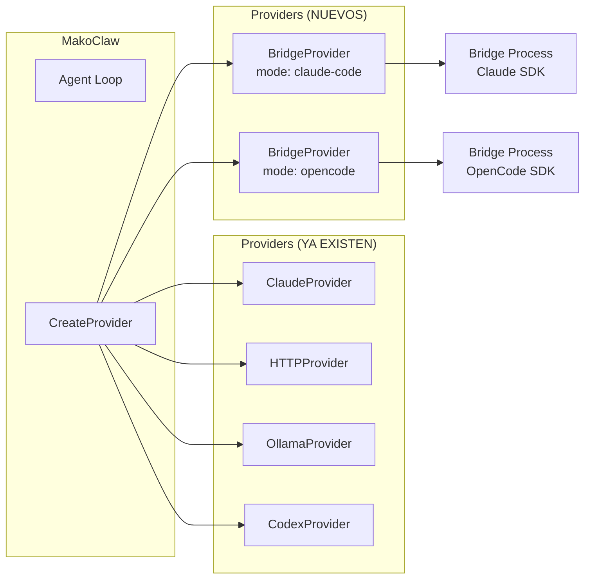

# 🔧 Complejidad de Implementación: Aurelia → MakoClaw

> **Contexto**: MakoClaw ya es un framework de agentes IA maduro (~92K líneas solo en `loop.go`, 24 packages en `pkg/`). La pregunta no es "¿podemos?" sino "¿cuánto esfuerzo y qué cambia?"

---

## 0. Estado Actual de MakoClaw vs Lo Que Aurelia Aporta

| Capacidad | MakoClaw HOY | Aurelia Aporta | Gap |
|-----------|-------------|----------------|-----|
| **LLM Providers** | 4 providers directos (Claude, HTTP/OpenAI, Codex, Ollama) | Bridge a Claude SDK (multiplexado) | **Nuevo paradigma**: CLI-backed providers |
| **Agent Definition** | Config JSON (`specialists` map) | Markdown + YAML frontmatter | **Alternativa más simple** |
| **Session Management** | File-based JSON, por-user namespaced | Token tracking + auto-reset + warm/cold | **Upgrade**: nos falta auto-reset |
| **Memory** | File-based markdown (MEMORY.md + daily notes) | SQLite + embeddings locales + cosine similarity | **UPGRADE MAYOR**: semántica vs texto plano |
| **Cron** | gronx-based scheduler con agent loop | SQLite-persisted, bridge-backed, delivery | **Comparable**, pero persistencia SQLite > |
| **Persona** | IDENTITY.md + SOUL.md + USER.md (ya lo tenemos) | Mismo + canonical identity service | **Ya lo tenemos** ✅ |
| **Multi-user** | ✅ Completo (UUID, workspace isolation) | ❌ Single-user | **Nosotros estamos adelante** |
| **Tools** | 20+ tools nativos + MCP | Hereda tools de Claude Code | **Diferentes paradigmas** |
| **Orchestration** | Multi-agent (orchestrator + specialists + swarm) | Single-agent per request | **Nosotros estamos adelante** |

---

## 1. Bridge Pattern: Dual-CLI Provider (OpenCode + Claude Code) ⭐⭐⭐

### ¿Qué es?

Un nuevo tipo de `LLMProvider` que en vez de llamar APIs HTTP directamente, lanza un proceso CLI externo (OpenCode o Claude Code) y se comunica via NDJSON.

### ¿Cómo coexisten?



### Decisión Arquitectónica Clave

> [!IMPORTANT]
> **¿El Bridge encaja como `LLMProvider`?** La respuesta es: **SÍ, pero con matices**.
>
> Aurelia usa el Bridge como UN PASO MÁS que un provider — envía prompts Y el Bridge ejecuta tools (Read, Write, Bash). Es Claude Code CLI completo, no solo LLM.
>
> Para MakoClaw, hay **dos opciones**:
>
> **Opción A — Bridge como Provider puro**: El `BridgeProvider` implementa `LLMProvider` y retorna respuestas como text. Los tools los ejecuta MakoClaw con su propio tool registry.
>
> **Opción B — Bridge como Executor autónomo**: El Bridge ejecuta todo (LLM + tools) y MakoClaw solo orquesta y entrega resultados. Similar a cómo Aurelia lo usa.
>
> **Recomendación: Opción B para el modo "local programming"**. Cuando estás programando con opencode/claude-code, querés que el CLI maneje los tools directamente (tiene acceso a filesystem, terminal, etc. nativo). MakoClaw orquesta CUÁNDO lanzar y QUÉ hacer con el resultado.

### Complejidad por componente

| Componente | Archivos nuevos | Líneas estimadas | Complejidad | Notas |
|-----------|----------------|------------------|-------------|-------|
| `pkg/bridge/bridge.go` | 1 | ~350 | Media | Port directo de Aurelia, adaptar a MakoClaw patterns |
| `pkg/bridge/protocol.go` | 1 | ~50 | Baja | Request/Response/Event types |
| `pkg/bridge/events.go` | 1 | ~40 | Baja | Event types |
| `pkg/bridge/setup.go` | 1 | ~80 | Baja | `EnsureBridge()` para auto-setup |
| `pkg/bridge/embed.go` | 1 | ~10 | Trivial | `go:embed` del bundle |
| `bridge/index.ts` | 1 | ~400 | Media | Port de Aurelia, agregar soporte OpenCode |
| `bridge/opencode.ts` | 1 | ~200 | Media | Wrapper para OpenCode SDK |
| `pkg/providers/bridge_provider.go` | 1 | ~200 | Media | Adapter `Bridge → LLMProvider` |
| Config additions | 0 (mod existing) | ~50 | Baja | Agregar `bridge` config section |
| **TOTAL** | **8** | **~1,380** | **Media** | 2-3 días de trabajo |

### Riesgos

> [!WARNING]
> - OpenCode NO tiene un SDK oficial como Claude Code. Habría que investigar si tiene algo equivalente a `@anthropic-ai/claude-agent-sdk` o si tenemos que hablar con su CLI via subprocess.
> - El `go:embed` del bundle agrega tamaño al binario (~7KB compressed, irrelevante).
> - Process lifecycle management en Windows puede tener edge cases (señales, pipes).

### Pregunta para vos

> [!IMPORTANT]
> ¿OpenCode expone algún SDK o API programática, o solo tiene CLI? Esto cambia radicalmente la implementación del Bridge para OpenCode. Necesitaría investigar su fuente.

---

## 2. Memory Store con Embeddings Locales ⭐⭐⭐

### Estado actual en MakoClaw

MakoClaw tiene `pkg/agent/memory.go` — un sistema **file-based** que lee/escribe markdown:
- `MEMORY.md` — long-term memory
- `memory/YYYYMM/YYYYMMDD.md` — daily notes
- `GetMemoryContext()` — concatena todo como texto

### Lo que Aurelia aporta

SQLite + embeddings locales (Hugot ONNX) para **búsqueda semántica**. Esto es un salto cualitativo ENORME.

### Complejidad por componente

| Componente | Archivos nuevos | Líneas estimadas | Complejidad | Notas |
|-----------|----------------|------------------|-------------|-------|
| `pkg/memory/store.go` | 1 | ~200 | Media | Port de Aurelia, usar nuestro SQLite |
| `pkg/memory/embeddings.go` | 1 | ~80 | Baja | Interface Embedder |
| `pkg/memory/embeddings_hugot.go` | 1 | ~70 | Media | Hugot ONNX embedder |
| `pkg/memory/schema.go` | 1 | ~20 | Trivial | SQL schema |
| Migrate `memory.go` | 0 (mod existing) | ~50 | Baja | Backward compat con MEMORY.md |
| go.mod changes | 0 | ~5 | Baja | Agregar `knights-analytics/hugot` |
| **TOTAL** | **4** | **~425** | **Media** | 1-2 días de trabajo |

### Integración con sistema existente

```go
// Actual: texto plano
memoryContext := memoryStore.GetMemoryContext()

// Nuevo: búsqueda semántica + texto plano (backward compatible)
semanticMemories, _ := semanticStore.Inject(ctx, userMessage, 10)
fileMemory := memoryStore.GetMemoryContext()
memoryContext := fileMemory + "\n\n" + semanticMemories
```

### Riesgos

> [!WARNING]
> - Hugot necesita un modelo ONNX (~23MB para all-MiniLM-L6-v2). Demo download en primer uso.
> - En hardware ultra-constrained (<10MB RAM target de MakoClaw), los embeddings locales podrían ser pesados. Hay que hacerlo **opt-in**.
> - La dependencia `knights-analytics/hugot` trae bastantes indirectas (gomlx, onnxruntime).

---

## 3. Agent Registry Enhanced (Markdown agents) ⭐⭐

### Estado actual

MakoClaw define specialists en `config.json` como maps — funcional pero verbose.

### Lo que Aurelia aporta

Agentes como archivos `.md` con YAML frontmatter — más legible, git-friendly.

### Propuesta de coexistencia

```
~/.MakoClaw/users/{uuid}/agents/    ← Markdown agent files (NEW)
~/.MakoClaw/users/{uuid}/config.json ← JSON specialists (EXISTING)
```

**Registry loads both sources** — markdown agents override JSON specialists with same name.

| Componente | Archivos nuevos | Líneas estimadas | Complejidad |
|-----------|----------------|------------------|-------------|
| `pkg/agent/markdown_registry.go` | 1 | ~150 | Baja |
| Agent routing enhancement | 0 (mod existing) | ~30 | Baja |
| SDK conversion (BuildSDKAgents) | 0 (mod existing) | ~30 | Trivial |
| **TOTAL** | **1** | **~210** | **Baja** — 0.5-1 día |

### Riesgo: Bajo

Coexiste perfectamente con el sistema actual. Es aditivo, no destructivo.

---

## 4. Session Auto-Reset con Token Tracking ⭐⭐

### Estado actual

MakoClaw ya tiene `SessionManager` que trunca a 500 mensajes y `CostTracker` que suma tokens. Pero NO tiene:
- Auto-reset basado en token threshold
- Warm/cold session concept

### Lo que se necesita

| Componente | Cambios | Líneas estimadas | Complejidad |
|-----------|---------|------------------|-------------|
| `pkg/session/manager.go` — add auto-reset | mod | ~40 | Baja |
| `pkg/agent/loop.go` — wire token tracking | mod | ~20 | Baja |
| Config: `max_session_tokens` | mod | ~5 | Trivial |
| **TOTAL** | **0 new files** | **~65** | **Baja** — medio día |

Aurelia estima `3000 tokens/turn` y resetea. Nosotros ya trackeamos tokens reales via `UsageInfo`, así que podemos ser más precisos.

---

## 5. Cron Persistence Upgrade ⭐

### Estado actual

MakoClaw ya tiene `pkg/cron/service.go` (20K lines!) con gronx scheduler. Está bastante completo.

### Lo que Aurelia aporta

- SQLite persistence de jobs y executions
- NotifyingRuntime pattern
- Bridge-backed execution

### Evaluación

> [!NOTE]
> Nuestro cron ya es más maduro en funcionalidad. Lo que falta es la **persistencia post-restart**. Si los jobs se pierden al reiniciar, eso es lo que hay que resolver. El modelo de Aurelia (SQLite store) es el approach correcto.

| Componente | Cambios | Complejidad |
|-----------|---------|-------------|
| Agregar SQLite persistence al cron existente | mod 1 file | ~200 líneas, media |
| **Timeline**: 1 día | | |

---

## 6. Persona / Canonical Identity ⭐

### Estado actual

MakoClaw YA TIENE el sistema de persona (`IDENTITY.md`, `SOUL.md`, `USER.md`) via `ContextBuilder`. 

### Lo que Aurelia aporta

- `CanonicalIdentityService` — assembler más robusto con canonical name resolution
- `OWNER_PLAYBOOK.md` y `LESSONS_LEARNED.md`

### Evaluación

> [!TIP]
> Esto es un **nice-to-have**, no un must. Nuestro `ContextBuilder.BuildContext()` ya hace prácticamente lo mismo. Podríamos agregar los playbooks como archivos opcionales que se inyectan, pero la inversión es mínima.

| Complejidad | Timeline |
|-------------|----------|
| Trivial (< 50 líneas) | 2 horas |

---

## 7. Resumen de Complejidad Total

| Feature | Complejidad | Esfuerzo | Prioridad | Dependencias |
|---------|------------|----------|-----------|-------------|
| **Bridge Pattern (dual CLI)** | Media | 2-3 días | 🔴 ALTA | Investigar OpenCode SDK |
| **Memory Embeddings** | Media | 1-2 días | 🟡 MEDIA | Hugot dependency |
| **Markdown Agents** | Baja | 0.5-1 día | 🟡 MEDIA | Ninguna |
| **Session Auto-Reset** | Baja | 0.5 día | 🟢 FÁCIL | Ninguna |
| **Cron Persistence** | Media | 1 día | 🟢 FÁCIL | SQLite (ya lo tenemos) |
| **Persona Enhancement** | Trivial | 2 horas | ⚪ OPT-IN | Ninguna |
| **TOTAL** | | **~6-8 días** | | |

---

## 8. Orden de Implementación Sugerido

```mermaid
gantt
    title Roadmap de Implementación
    dateFormat  X
    axisFormat %s
    
    section Phase 1 - Quick Wins
    Session Auto-Reset     :done, 0, 1
    Cron Persistence       :done, 1, 2
    Persona Enhancement    :done, 2, 3
    
    section Phase 2 - Core
    Markdown Agent Registry :active, 3, 4
    Memory Embeddings Store :active, 4, 6
    
    section Phase 3 - Bridge
    Bridge Protocol (Go)   :6, 8
    Bridge TS (Claude Code) :8, 9
    Bridge TS (OpenCode)    :9, 10
    Provider Integration    :10, 11
```



### Phase 1 — Quick Wins (1 día)
Todo lo que es `mod existing files` sin archivos nuevos:
- Session auto-reset
- Cron SQLite persistence  
- Persona playbooks

### Phase 2 — Core Features (2-3 días)
Features nuevos con archivos nuevos pero sin dependencias complejas:
- Markdown agent registry
- Memory store con embeddings

### Phase 3 — Bridge System (3-4 días)
El feature más complejo, requiere investigación previa:
- Bridge protocol en Go
- Bridge TypeScript (Claude Code)
- Bridge TypeScript (OpenCode) ← **requiere investigar el SDK**
- Integración como provider

---

## 9. Preguntas Abiertas para Vos

> [!IMPORTANT]
> 1. **OpenCode**: ¿Tiene un SDK/API programática o solo CLI? ¿Se comunica via JSON/NDJSON o tiene su propio protocolo? Esto define el 50% del esfuerzo del Bridge.
> 
> 2. **Modo Bridge vs Provider**: Cuando usás opencode/claude-code localmente, ¿querés que MakoClaw delegue TODO (LLM + tools) al CLI? ¿O querés que solo use el LLM y MakoClaw maneje los tools?
>
> 3. **Memory Embeddings**: ¿El target de <10MB RAM sigue vigente? Si sí, los embeddings locales (Hugot) serían opt-in. ¿Está bien?
>
> 4. **Prioridad**: ¿Empezamos por el Bridge (lo más complejo pero lo más valioso) o por los quick wins para ir sumando valor incremental?
